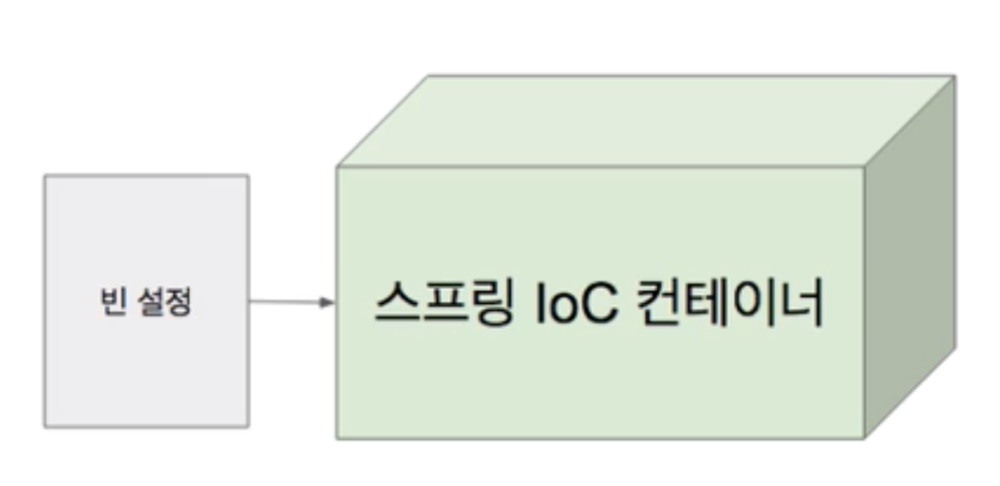
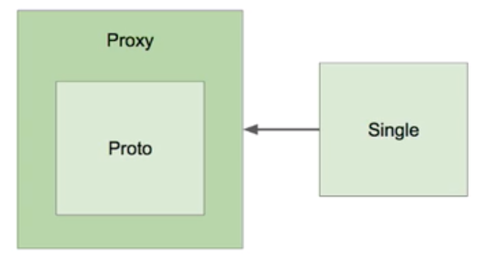
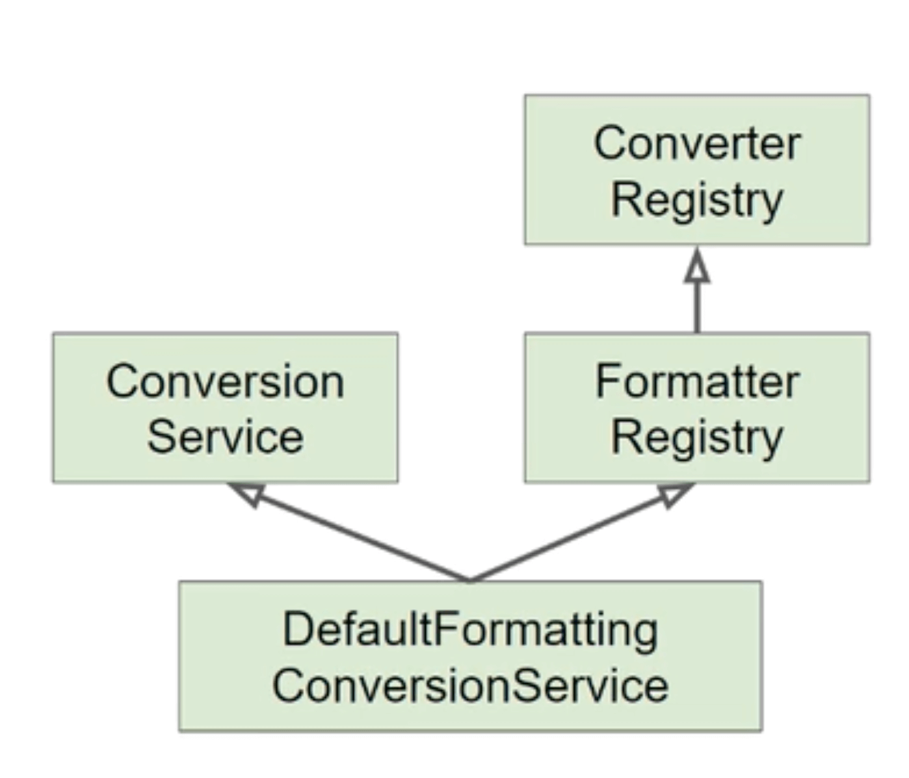
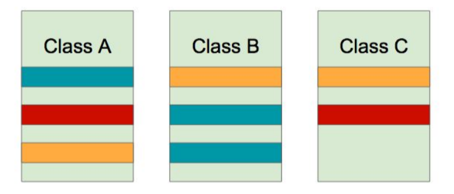
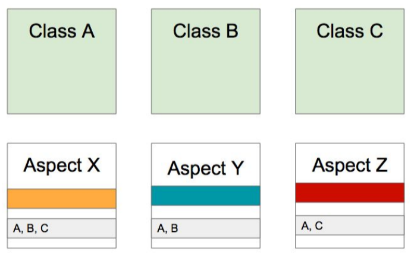
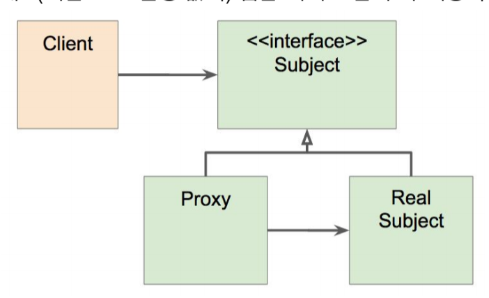

# Spring Core(스프링 핵심 기술(Core) - 인프런 백기선님 강의)

### 스프링

- 소규모 애플리케이션 또는 기업용 애플리케이션을 자바로 개발하는데 있어 유용하고 편리한 기능을 제공하는 프레임워크

### 스프링 디자인 철학

- 모든 선택은 개발자의 몫.(스프링은 특정 기술을 강요하지 않는다.)

- 다양한 관점을 지향한다.(유연성)

- 하위 호환성을 지킨다.(노력)

- API를 신중하게 설계한다.(공들인다)

- 높은 수준의 코드를 지향한다.(자랑)

  

## IoC 컨테이너 1부: Spring IoC Container 와 Bean

- **Inversion of Control: 의존 관계 주입(Dependency Injection)이라고도 하며, 어떤 객체가 사용하는 의존 객체를 직접 만들어 사용하는 것이 아니라, 주입 받아 사용하는 방법**

1. Spring IoC 컨테이너

- BeanFactory 인터페이스가 가장 핵심
- BeanFactory를 상속받은 ApplicationContext가 가장 많이 사용됨
- 애플리케이션 컴포넌트의 중앙 저장소
- **빈 설정 소스로 부터 빈 정의를 읽어들이고, 빈을 구성하고 제공한다**

2. Bean

- 스프링 IoC 컨테이너가 관리 하는 객체
- 기본적으로 싱글톤 Scope으로 빈을 관리
- 장점
  - 스코프
    - 싱글톤: 하나의 객체만 생성됨
    - 프로토타입: 매번 다른 객체
  - 의존성 관리
  - 라이프사이클 인터페이스(빈의 생성, 소멸 등의 사건이 발생할때 무언가 작업을 할 수 있음)

3. ApplicationContext
   - BeanFactory
   - 메시지 소스 처리 기능(i18n)
   - 이벤트 발행 기능
   - 리소스 로딩 기능 
   - ..


## IoC 컨테이너 2부: ApplicationContext와 다양한 Bean 설정 방법



### IoC 컨테이너의 역할

- Bean 인스턴스 생성
- 의존 관계 설정
- Bean 제공

**Spring Boot**로 프로젝트 시작시 web-starter 의존성이 자동으로 설정되며, 웹 개발에 필요한 core, context, beans, mvc등의 의존성이 자동으로 설정되므로, 복잡하게 pom.xml을 설정해줄 필요가 없다.

1. application.xml 파일, 태그 설정
   - <bean>태그를 이용해 생성할 빈 설정
     - name 설정
     - class 설정
     - scope 설정: 싱글톤, 프로토타입 등
     - constructor arguments 설정
     - setter 설정
     - autowrie 설정
   - <bean>태그 내부에, <property>태그를 통해서 
   - ClassPathXmlApplicationContext(XML)을 통해서 context 생성
2. application.xml 파일, component-scan xorm 설정
   - annotation을 설정해둔 bean을 읽어들여 생성함
3. ApplicationConfig 클래스를 생성하여 설정하는 방법
   - @Configuration annotation을 ApplicationConfig class에 적용
   - 해당 클래스 내부에 @Bean 태그를 원하는 메소드에 붙여 사용함
   - AnnotationConfigApplicationContext(ApplicationConfig.class) 를 사용하여 context 생성
   - @Bean 대신 @Autowired를 사용하는 것도 가능
4. ApplicatonConfig 클래스에, @ComponentScan(basePackageClasses = DemoApplication.class)를 사용해서 해당 파일 부터 컴포넌트 어노테이션이 붙어 있는 빈을 가져와 생성함

**Spring Boot 에서는 @SpringBootApplication을 통해서 Context도 만들 수 있으며, 따로 ApplicationConfig 파일도 필요로 하지 않는다.**


## IoC 컨테이너 3부: @Autowire

- 필요한 의존 객체의 "타입"에 해당하는 빈을 찾아 주입한다.
- required: 기본값은 true(즉, 의존 객체를 못 찾으면 에플리에키연 구동 실패)
- 사용할 수 있는 위치
  - 생성자
  - 세터
  - 필드
- 경우의 수
  - 해당 타입의 빈이 없는 경우
  - 해당 타입의 빈이 한 개인 경우
  - 해당 타입의 빈이 여러 개인 경우
    - 빈 이름으로 시도,
      - 같은 이름의 빈 찾으면 해당 빈 사용
      - 같은 이름 못 찾으면 실패
- 같은 타입의 빈이 여러개 일 때(예: interface가 타입인 경우)
  - @Primary
  - 해당 타입의 빈 모두 주입 받기
  - @Qualifier("빈 이름")
- 동작원리
  - 첫 시간에 잠깐 언급했던 빈 라이프사이클 기억하세요?
  - BeanPostProcessor: 새로 만든 빈 인스턴스를 수정할 수 있는 라이프 사이클 인터페이스
    - Bean의 라이프 사이클(Initialization) 후에 어떤 작업을 해주고 싶을 때, @PostConstruct 를 사용할 수 있다.
  - AutowiredAnnotationBeanPostProcessor extens BeanPostProcessor
    - 스프링이 제공하는 @Autowired와 @Value 에노테이션 그리고 JSR-330의 @Inject 에노테이션을 지원하는 에노테이션 처리기
    - 기본적으로 AutowiredAnnotationBeanPostProcessor라는 빈이 생성되어 있고, 이 빈을 이용해 빈의 라이플 메서드를 처리함


## IoC 컨테이너 4부: @Component와 컴포넌트 스캔

1. 컴포넌트 스캔 주요 기능

   - 스캔 위치 설정
   - 필터(어떤 에노테이션을 스캔 할지 또는 하지 않을지)

2. 컴포넌트 종류

   @Component

   - @Repository
   - @Service
   - @Controller
   - @Configuration

3. 동작 원리

   - @ComponentScan은 스캔할 패키지와 어노테이션에 대한 정보
   - 실제 스캐닝은 ConfigurationClassPostProcessor라는 BeanFactoryPostProcessor에 의해 처리됨.

4. Function을 사용한 빈 등록( 에플리케이션 구동 타임에 모든 객체를 생성하는 것이 아니므로, 성능 상에 이점이 있음 )

   ```java
   public static void main(String[], args){
     new SpringApplicationBuilder()
       .sources(Dempospring51Application.Class)
       .initializers(ApplicationContextInitializer<GenericApplicationContext>)
       applicationContext ->{
       applicationContext.registerBean(MyBean.class);
       .run(args);
     }
   }
   ```

   

## IoC 컨테이너 5부: Bean의 Scope

1. Scope

   - 싱글톤(기본값)
     - 모든 싱글톤 스코프의 빈은 ApplicationContext를 생성시 생성되기 때문에, 구동시간에 영향을 줄 수 있다.
   - 프로토타입(@Scope("prototype") 으로 설정 가능)
     - 빈을 가져올때마다 다른 인스턴스를 생성하여 반환
     - Request
     - Session
     - WebSocket

2. 프로토타입 빈이 싱글톤 빈을 참조하면?

   - 문제 없음

3. 싱글톤 빈이 프로토타입 빈을 참조하면?

   - 동일한 프로토타입 빈의 인스턴스만 참조하게 됨

   - 해결방법

     - scoped-proxy 방법

       - ```@Scope(value="prototype", proxyMode = ScopedProxyMode.TARGET_CLASS)```로 설정하면 해결

       - 해당 Proto 빈을 Class 기반의 Proxy로 감싸라는 의미

       - 그러면, 매번 Proto 빈을 참조할때마다, Proxy를 거치게 되고, Proxy가 매번 다른 Proto를 반환하도록 처리해줌

     - Object-Provider 방법

       - Spring 소스를 이용해 Bean Class에서 처리

     - Provider(표준)

4. 프록시

   

5. 싱글톤 객체 사용시 주의할 점
   - 프로퍼티가 공유됨
   - ApplicationContext 초기 구동시 인스턴스 생성


## IoC 컨테이너 6부: Environment 1부. 프로파일

- 프로파일과 프로퍼티를 다루는 인터페이스


1. ApplicationContext extens EnvironmentCapable
   - getEnvironment()
2. 프로파일
   - 빈들의 그룹
   - Environment의 역할은 활성화할 프로파일 확인 및 설정
3. 프로파일 유즈케이스
   - 테스트 환경에서는 A라는 빈을 사용하고, 배포 환경에서는 B라는 빈을 쓰고 싶다.
   - 이 빈은 모니터링 용도니까 테스트할 때는 필요가 없고 배포할 때만 등록이 되면 좋겠다.
4. 프로파일 정의하기
   - 클래스에 정의
     - @Configuration @Profile("test")
     - @Component @Profile("test")
   - 메소드 정의
     - @Bean @Profile("test")
5. 프로파일 설정하기
   - -Dspring.profile.active = "test, A, B, ///"
   - @ActiveProfiles(테스트용)
6. 프로파일 표현식
   - !(not)
   - &(and)
   - |(or)


## IoC 컨테이너 6부: Environment 2부. 프로퍼티

1. 프로퍼티
   - 다양한 방법으로 정의할 수 있는 설정값
   - Environment의 역할은 프로퍼티 소스 설정 및 프로퍼티 값 가져오기
2. 프로퍼티에는 우선 순위가 있다.
   - StandardServeletEnvironment의 우선순위
     - ServletConfig 매개변수
     - ServletContext 매개변수
     - JNDI(java:com/env/)
     - JVM 시스템 프로퍼티(-Dkey="value")
     - JVM 시스템 환경 변수(운영 체제 환경 변수)
3. @PropertySource
   - Environment를 통해 프로퍼티 추가하는 방법
4. 스프링 부투의 외부 설정 참고
   - 기본 프로퍼티 소스 지원(application.properties)
   - 프로파일까지 고려한 계층형 프로퍼티 우선 순위 제공


## IoC 컨테이너 7부: MessageSource

1. 국제화(i18n) 기능을 제공하는 인터페이스
2. ApplicationContext extends MessageSource
   - getMessage(String code, Object[] args, String, default, Locale, Ioc)
3. 스프링 부트를 사용한다면 별다른 설정 필요없이 message.properties 사용할 수 있음
   - message.properties
   - message_ko_kr.properties
4. 릴로딩 기능이 있는 메세지 소스 사용하기


## IoC 컨테이너 8부: ApplicationEventPublisher

1. 이벤트 프로그래밍에 필요한 인터페이스 제공(옵저버 패턴 구현체)
2. ApplicationContext extends ApplicationEventPublisher
   - publishEvent(ApplicationEvent event)
3. 이벤트 만들기
   - ApplicationEvent 상속
   - 단, Spring 4.2 이후부터는 상속 없이 사용 가능
4. 이벤트 발생
   - ApplicationEventPulbisher.publishEvnet()
5. 이벤트 처리
   - ApplicationListener<Event> 구현한 클래스 만들어서 빈으로 등록하기
   - 단, Spring 4.2 부터는 @EventListener를 사용해서 빈의 메소드에 사용할 수 있다.
   - 기본적으로는 Synchronized
   - 순서를 정하고 싶다면 @Order와 함께 사용
   - 비동기적으로 실행하고 싶다면 @Async 와 함께 사용(+ @EnableAsync)
6. 스프링이 제공하는 기본 이벤트
   - ContextRefreshedEvent: ApplicationContext를 초기화 했거나 리프레시 했을 때 발생
   - ContextStartedEvent: ApplicationContext를 start()하여 라이프사이클 Bean들이 시작 신호를 받은 시점에 발생
   - ContextStoppedEvent: ApplicationContext를 stop()하여 라이프사이클 Bean들이 정지 신호를 받은 시점에 발생
   - ContextClosedEvent: ApplicationContext를 close()하여 싱글톤 Bean 소멸되는 시점에 발생
   - RequestHandlesEvent: HTTP 요청을 처리했을 때 발생

**스프링 철학(Transparent, 투명성, 비침투성): 스프링 코드가 내가 작성하는 코드에 투입되지 않는것, 코드 유지보수/테스트가 더 쉬워짐**


## IoC 컨테이너 9부: ResourceLoader

1. 리소스를 읽어오는 기능을 제공하는 인터페이스
2. ApplicationContext extends ResourceLoader
3. 리소스 읽어오기
   - 파일 시스템에서 읽어오기
   - 클래스패스에서 읽어오기("classpath:test.txt")
   - URL로 읽어오기
   - 상대/절대 경로로 읽어오기
4. Resource getResource(java.lang.String location)


## Resource 추상화

- org.springframework.core.io.Resource

1. 특징
   - java.net.URL을 추상화 한 것
   - 스프링 내부에서 많이 사용하는 인터페이스
2. 추상화 이유
   - classpath 기준으로 리소스 읽어오는 기능 부재
   - ServeltContext를 기준으로 상대 경로로 읽어오는 기능 부재
   - 새로운 핸들러를 등록하여 특별한 URL 접미사를 만들어 사용할 수는 있지만, 구현이 복잡하고 편의성 메소드가 부족
3. Resource Interface
   - 상속 받은 인터페이스
   - 주요 메소드
     - getInputStream()
     - exist(): 파일 존재 여부
     - isOpen(): 파일 열려있는지 여부
     - getDescription(): 전체 경로, 파일 이름 또는 실제 URL
4. 구현체
   - UrlResource: http, https, ftp, file, jar
   - ClassPathResource: 접두어 classpath:
   - FileSystemResource: 접두어 file ( 절대경로 희망시 file:///)
   - ServletContextResource: 웹 에플리케이션 root에서 상대 경로로 리소스 찾는다.
5. 리소스 읽어오기
   - Resource 타입은 location 문자열과 ApplicationContext의 타입에 따라 결정된다.
     - ClassPathXmlAppliactionContext -> ClassPathResource
     - FileSystemXmlApplicationContext -> FilesSystemResource
     - WebApplicationContext -> ServeltContextResource
   - ApplicationContext의 타입에 상관없이 Resource 타입을 강제하려면 java.net.URL 접두어중 하나를 사용할 수 있다.
     - classpath:src/image -> ClassPathResource
     - file:///Desktop/project/src/image -> FileSystemResource


## Validation 추상화

- org.springframework.validation.Validator

- 애플리케이션에서 사용하는 객체 검증용 인터페이스

1. 특징
   - 어떠한 계층(Layer)과도 상관이 없다.(즉, 모든계층(웹, 서비스, 데이터)에서 사용해도 좋다.)
   - 구현체 중 하나로, JSR-303(Bean Validation 1.0)과 JSR-349(Bean Validation 1.1)을 지원한다.
   - DataBinder에 들어가 바인딩 할 때 같이 사용되기도 한다.
2. 인터페이스
   - boolean supports(Class clazz): 어떤 타입의 객체를 검증할 때 사용할 것인지 결정함
   - void validate(Object obj, Error e): 실제 검증 로직을 이 안에서 구현
     - 구현시 ValidationUtils 사용하면 편리함
3. SpringBoot 2.0.5 이상 버전을 사용할 때
   - LocalValidatorFactoryBean 빈으로 자동 등록됨
   - JSR-380 구현체로 hibernate-validator 사용


## 데이터 바인딩 추상화: PropertyEditor(구식)

- org.springframework.validation.DataBinder

1. 기술적 관점

   - 프로퍼티 값을 타겟 객체에 설정하는 기능

   사용자 관점

   - 사용자 입력값을 애플리케이션 도메인 모델에 동적으로 변환해 넣어주는 기능

   해석(사용 이유)

   - 입력값은 대부분 "문자열"인데, 그 값을 객체가 가지고 있는 int, long, Boolean, Date 등 심지어 Event, Book 같은 도메인 타입으로도 변환해서 넣어주는 기능

2. PropertEditor

   - Spring 3.0 이전까지 Databinder가 변환 작업시 사용하던 인터페이스
   - Spring 여기저기서 많이 사용되는 중요한 개념
   - 단점1) Thread-safe 하지 않음
   - 그래서, 절대로 빈으로 등록해서 사용하면 안됨
   - 단점2) Object와 String 간의 변화만 할 수 있어, 사용 범위가 제한적임(그래도 사용되왔음)

```java
public class EventPropertyEditor extends PropertyEditorSupport{
  @Override
  public String getAsText(){
    return ((Event)getValue()).getTitle();
  }
  @Override
  public void setAsText(String text) throws IllegalArgumentException{
    int id = Integer.parseInt(text);
    Event event = new Event();
    event.setId(id);
    setValue(event);
  }
}
```


## 데이터 바인딩 추상화: Converter 와 Formatter(신식, spring 3.0 이상)

1. Converter

   - S 타입을 T 타입으로 변환할 수 있는 매우 일반적인 변환기
   - 상태 정보 없음(즉, Stateless == Thread Safe함)
   - ConverterRegistry에 등록해서 사용

   ```java
   public class StringToEventConverter implements Converter<String, Event>{
     @Override
     public Event convert(String source){
       Event event = new Evenet();
       event.setId(Integer.pareseInt(source));
       return event;
     }
   }
   ```

2. Formatter

   - PropertyEditor를 대체함
   - Object와 String 간의 변환을 담당함
   - 문자열을 Locale에 따라 다국화하는 기능도 제공
   - FormatterRegistry에 등록해서 사용

```java
public class EventFormatter implements Formatter<Event>{
  @Override
  public Event parse(String text, Locale locale) throws ParseException{
    Event event = new Event();
    int id = Integer.parseInt(text);
    event.setId(id);
    return event;
  }
  
  @Override
  public String print(Event object, Locale locale){
    return object.getId().toString();
  }
}
```

3. ConversionService
   - 실제 변환 작업은 이 인터페이스를 통해서 한다.
   - Thread-Safe 함
   - Spring MVC, Bean(value) 설정, SpEL에서 사용
   - DefaultFormattingConversionService
     - FormatterRegistry
     - ConversionService
     - 여러 기본 Converter와 Formatter 등록 해 줌



4. Spring Boot
   - 웹 애플리케이션인 경우에 DefaultFormattingConversionService를 상속하여 만든 WebConversionService를 빈으로 등록해 준다.
   - 또한, Formatter와 Convertter 빈을 찾아 자동으로 등록해 준다.

5. 예시
   - @GetMapping 부분에서 {event} 문자열 부분이 event Object로 데이터 바인딩 되는 부분들이, 위의 장치들에 의해서 자동 바인딩 되는 것 임.

```java
public class EventController{
  @GetMapping("/event/{event}") 
  public String getEvent(@PathVariable Evnent event){
    System.out.println(event);
    return event.getId().toString();
  }
}
```


## SpEL(Spring Expression Language)

1. SpEL 이란?

   - 객체 그래프를 조회하고 조작하는 기능을 제공한다.
   - Unified EL과 비슷하지만, 메소드 호출을 지원하며, 문자열 템플릿 기능도 제공한다.
   - OGNL, MVEL, JBOss EL 등 자바에서 사용할 수 있는 여러 EL이 있지만, SpEL은 모든 스프링 프로젝트 전반에 걸쳐 사용할 EL로 만들었다.
   - Spring 3.0 부터 지원

2. SpEL 구성

   - 즉,  #{} 표현식을 사용하면 알아서 아래의 과정이 진행된다고 생각할 수 있다.

   - ExpressionParser parser = new SpelExpressionParser()
   - StandardEvaluationContext context = new StandardEvaluationContext(bean)
   - Expression expression = parser.parseExpression("SpEL 표현식")
   - String value = expression.getvalue(context, String.class)

3. 문법

   - ```#{"표현식"}```

   - ```${"프로퍼티"}```
   - 표현식은 프로퍼티를 가질 수 있지만, 반대는 안 됨

4. 실제로 어디에 쓰나?

   - @Value 어노테이션
   - @ConditionalOnExpression 어노테이션
   - 스프링 시큐러티
     - 메소드 시큐러티, @PreAuthorize, @PostAuthorize, @PreFilter, @PostFilter
     - XML 인터셉터 URL 설정
   - 스프링 데이터
     - @Query 어노테이션
   - Thymeleaf

5. 예시

   ```java
   @Component
   public class AppRunner implements ApplicationRunner{
     @Value("#{1 + 1}")
     int value;
     
     @Value("#{'hello'+'world'}")
     String greeting;
     
     @Value{"#{1 eq 1}"}
     boolean trueOrFalse;
     
     @Value{"hello"}
     String hello;
     
     /*application.properties 파일에 설정해둔 property를 사용가능하다는 것*/
     @Value("${my.value}") 
     int myValue;
     
     @Value("#{${my.value} eq 100}")
     boolean isMyValue100;
     
     @Override
     public void run(ApplicationArguments args) throws Exception{
       System.out.println("===============");
       System.out.println(value);
       System.out.println(greeting);
       ...
     }
   }
   ```

   

## Spring AOP: 개념 소개

- Aspect-oriented Programming(AOP)는 OOP를 보완하는 수단으로, 흩어진 Aspect를 모듈화 할 수 있는 프로그래밍 기법.
- AspectJ를 활용하는 기능도 있고, Spring이 직접 제공하는 기능도 있다.

1. 흩어진 관심사(Crosscutting Concerns)



- 관심사(Concerns)
  - 예를들어, 트랜잭션 로직
  - 공통으로 사용 되는 소스 코드

2. AOP를 적용한 그림



3. 용어정리
   - Aspect: 공통 로직을 따로 빼낸 것(모듈)
   - Target: Aspect가 갖고 있는 Advice를 적용할 Class를 의미
   - Advice: Aspect에 정의되어 있는 해야할 일
   - Join point: 끼어들 수 있는 지점(예를들어, 메소드 실행할때, 생성자 호출 직전/직후 등), 매우 다양한 시점에 실행시킬 수 있음
   - Pointcut: 어디에 적용되어야 하는지(예를들어, A라는 클래스에 b라는 메소드를 호출할때)

4. AOP 구현체
   - 각 언여별 구현체를 wiki에서 확인가능
   - 자바
     - AspectJ
     - Spring AOP
5. AOP 적용 방법
   - 컴파일시(자바 파일을 클래스 파일로 만들때, 바이트코드가 조작됨)
     - 장점) 로드타임/런타임시 성능 부하가 없다.
     - 단점) 따로 컴파일 처리를 해줘야 한다.
   - 로드 타임(컴파일은 순수하게 컴파일되고, 클래스를 JVM에 로딩하는 시점에 끼워넣는다 == loadtimeweaving)
     - 장점) AspectJ를 사용할 수 있으므로, 다양한 문법을 사용가능.
     - 단점) 로드 타임시 성능 부하 될 수 있음. 또, loadtimeweaver를 설정해줘야함
   - 런타임(이미 클래스들은 모두 로드되어있고, 각 클래스를 Bean 초기화 및 생성하는 시점)
     - Proxy 빈을 만들어서 해당 빈을 감싸서 해당 기능을 제공한다.
     - 우리는 보통 Sprign AOP를 사용하면 이 런타임 적용 방법이 적용된다.
     - AspectJ를 사용해야되는 경우도 있는데, 이 경우에 컴파일시/로드타임 적용 방법을 사용하게 된다.


## Spring AOP: Proxy 기반 AOP

1. Spring AOP 특징
   - Proxy 기반의 AOP 구현체
   - Spring Bean에만 AOP를 적용할 수 있다.
   - 모든 AOP 기능을 제공하는 것이 목적이 아니라, 스프링 IoC와 연동하여 엔터프라이즈 애플리케이션에서 가장 흔한 문제에 대한 해결책을 제공하는 것이 목적
2. Proxy 패턴
   - 사용이유: 기존 코드 변경 없이, "접근 제어" 또는 "부가 기능" 추가
   - 문제점
     - 매번 Proxy Class를 작성해야 하는가?
     - 여러 Class 여러 Method에 적용하려면?
     - 객체들 관계가 복잡하다.

 

3. 위 문제를 해결하기 위해, Spinrg AOP를 만든 것
   - Spring IoC Container가 제공하는 기반 시설과 Dynamic Proxy를 사용하여 여러 복잡한 문제 해결
   - 동적 프록시(Dynamic Proxy): 동적으로 Proxy 객체를 생성하는 방법
     - 자바가 제공하는 방법은 인터페이스 기반 프록시 생성
     - CGlib은 클래스 기반 프록시도 지원
   - Spring IoC: 기존 빈을 대체하는 동적 Proxy Bean을 만들어 등록 시켜준다.
     - 클라이언트 코드 변경 없음
     - AbstractAutoProxyCreator implements BeanPostProcessor


## Spring AOP: @AOP

- 어노테이션 기반의 Spring @AOP

1.  의존성 추가

   ```xml
   <dependency>
   	<groupId>or.springframework.boot</groupId>
     <artifactId>spring-boot-starter-aop</artifactId>
   </dependency>
   ```

2. Aspect 정의

   - @Aspect
   - 빈으로 등록해야 하니까, (컴포넌트 스캔을 사용한다면) @Component추가

3. Pointcut 정의

   - @Pointcut(표현식)
   - 주요 표현식
     - execution
     - @annotation
     - bean
   - Pointcut 조합
     - &&, ||, !

4. Advice 정의

   - @Before: 모든 메소드 실행 이전에 advice 실행됨
   - @AfterReturning
   - @AfterThrowing
   - @Around

5. 참고

   - docs spring io. aop-poincuts

6. 사용예

```java
@Component
@Aspect
public class perfAspect{
  @Around("execution(* me.whiteship..*.EventService.*(..))") // pointcut
  public Object logPerf(ProceedingJoinPoint pjp) throw Throwable{
    long begin = System.currentTimeMillis(); // 메소드 실행 전 원하는 작업 주입(Advice)
    Object retVal = pjp.proceed(); // 실제 메소드를 실행
    System.out.print(System.currentTimeMills()-begin); // 메소드 실행 후 원하는 작업 주입(Advice)
    return retVal;
  }
}
```

```java
@Documented
@Target(ElementType.METHOD)
@Retention(RetentionPolicy.CLASS)
public @interface PerLogging{
}

//위와 같은 annotation을 설정하면
@Around("@annotation(PerLogging)")을 사용하면 @PerLogging이라는 어노테이션이 붙어있는 메소드만 pointcut으로 설정됨
```

```java
//bean을 설정하면, 해당 빈의 모든 메소드에 적용됨
@Around("bean(simpleEventServie)")
```


## Null-safety

- Spring5에 추가된 Null 관련 어노테이션

1. 종류
   - @NonNull: null을 허용하지 않는 어노테이션
   - @Nullable: null을 허용하는 어노테이션
   - @NonNullApi(패키지 레벨 설정): 패키지 이하에 모든 것에 Null을 허용하지 않는 어노테이션
   - @NonNullFields(패키지 레벨 설정)
2. 목적
   - (툴의 지원을 받아) 컴파일 시점에 최대한 NullPoingException을 방지하는 것

3. IntelliJ에서 사용하고 싶은 경우
   - Preferences -> Complier -> Configure annotations -> Nullable/NonNull 영역에 spring에 있는 어노테이션 추가 -> 재시작